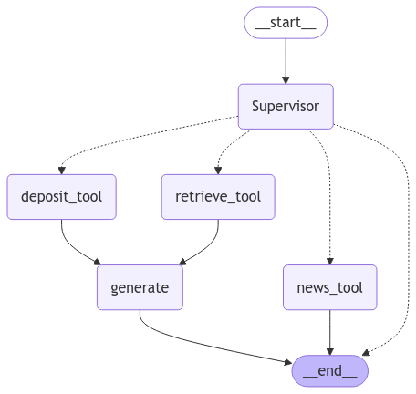
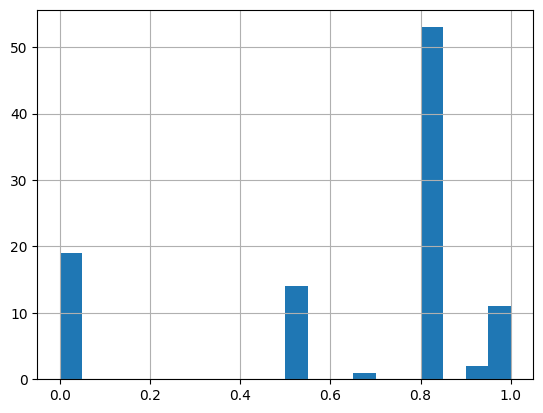

# FinanceInsight

## Архитектура решения

Наше решение представляет собой `RAG` пайплайн, которы поможет ответить вам на вопросы о финансах, экономику, бизнес, вклады. Также он способен найти нормативные акты по вашему запросу касаемо экономики

## Данные

1. Данные из финансовых статей, книг и курсов
    - Financial Markets and Institutions 7th ed. Frederic S. Mishkin, Stanley G. Eakins
    - Principles of macroeconomics 3th ed. David Shapiro, Daniel MacDonald, Steven A. Greenlaw
    - Principles of microeconomics 3th ed. David Shapiro, Daniel MacDonald, Steven A. Greenlaw
    - Principles of economics 3th ed. David Shapiro, Daniel MacDonald, Steven A. Greenlaw
    - Principles of Finance. Julie Danhlquist, Rainford Knight
    - Capital Markets And Securities Laws.
    - Securities Trading: Principles and Procedures. Joel Hasbrouck
    - Курсы по финансовой грамотности от bks и tinkoff
    - Кодекс РФ

2. Нормативные документы
    - [КонсультантПлюс](https://www.consultant.ru)

3. Актуальные новости про бизнес и финансы
    - [Rambler finance](https://finance.rambler.ru/economics/)
    - [Tinkoff journal](https://journal.tinkoff.ru/flows/news/)
    - [RBC](https://www.rbc.ru/business/)


**P.S.** Более подробно об сборе и анализе данных можно посмотреть по этой [ссылке](https://github.com/favead/financial-data-pipeline/tree/main)


## RAG Pipeline



## Оценка ретривера

Abstract: к 100 случайным чанкам из документов Консультант+ (источник выбран как самый релеватный для ретрива) генерировались вопросы с помощью `mistral-large-latest`. Для ретрива использовалась функция retrieve_v1 аналогичная тулу retrieve в FinanceMultiAgentRAG. По полученным документам рассчитывались метрики precision@1, recall@2. 

В качестве агрегированных метрик представлены усредненные precision@1 и precision@2 на 100 документах: 
avg_precision@1 = 0.59
avg_recall@2 = 0.62

Эксперимент можно найти в ноутбуке `check_chunks.ipynb`

## Метрики

В качестве метрики использовалась методика `Response vs input` в качестве судьи которой была модель `ministral-8b-latest`

>Вопросы, которые использовались для оценки находятся в файле `questions_for_metrics.json`. Расчёт метрики находиться в файле `metrics.ipynb`

В среднем по оценки `Судьи` наш `RAG пайплайн` раскрывает весь вопрос на `0.6289 %`


Гистограмма оценки **вопросов - ответов**



## Примеры использования 

1. Для начала необходимо склонировать репозиторий командой

    ```cmd
    git clone https://github.com/YarickVodila/FinanceInsight.git
    ```

2. Устанавливаем `requirements.txt`
    ```cmd
    pip install -r requirements.txt
    ```

3. Определение индексированной базы данных `FAISS`

    1. Переходим в файл `rag_pipeline.py` который находиться по пути `FinanceInsight/apps/rag_system/rag_pipeline.py`
    2. В переменную `FAISS_DB` записываем путь до вашей базы данных. **P.S.** скачать нашу базу можно [тут](https://drive.google.com/file/d/1ZJpODxrIUufjtp1993AEv5vnhhjtVp_3/view?usp=sharing)

4. Импортируем класс и пользуемся 🤩
    ```py
    import os
    from IPython.display import Markdown, Image
    from apps.rag_system.rag_pipeline import FinanceMultiAgentRAG

    with open("Your API Key for Mistral", "r") as f:
        os.environ["MISTRAL_API_KEY"] = f.readline()

    api_key = os.environ["MISTRAL_API_KEY"]

    pipeline = FinanceMultiAgentRAG(
        api_key = api_key
    )

    output = pipeline.get_response("Что такое финансовая грамотность?")

    Markdown(output)
    ```


**P.S.** Пример работы пайплайна находиться в `testing_pipeline.ipynb`

## Запуск

В контейнере запускается эндпоинт `/generate` по fastAPI, который принимает запрос пользователя и возвращает
```json
{
    "response": ...
}
```
Если модель не нашла ответ, либо произошла ошибка в обработке, то возвращается пустая строка

### Сборка контейнера:
```bash
docker build -t finance-insight:1.0 .
```

### Запуск с монтированием директории с индексами:
```bash
docker run -p 8000:8000 -v local-path-to/data/index:/app/data/index --env-file .env_vars --rm finance-insight:1.0
```
